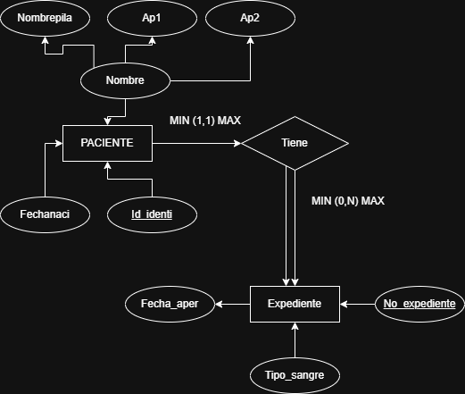
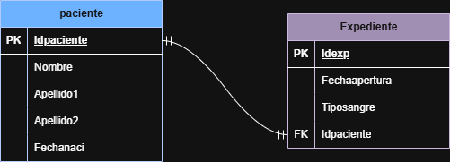
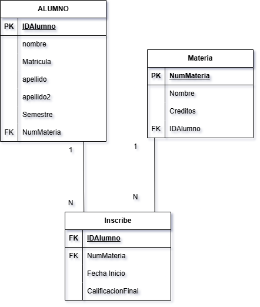
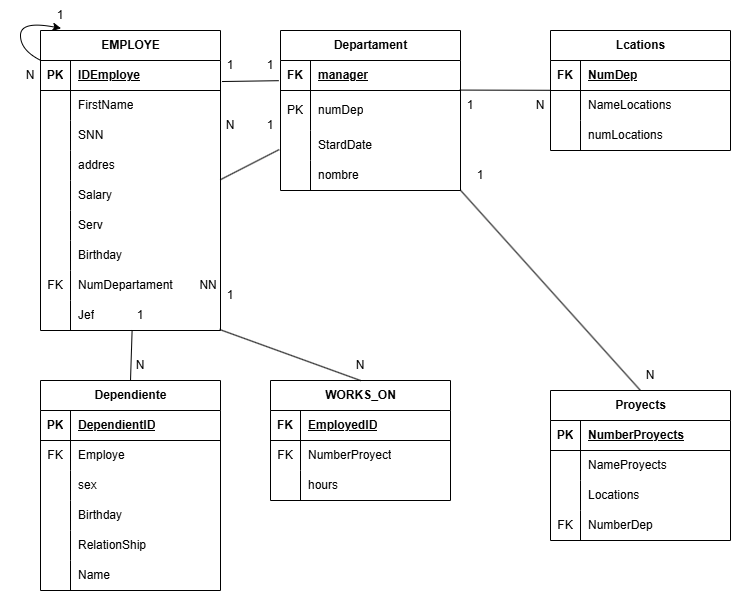
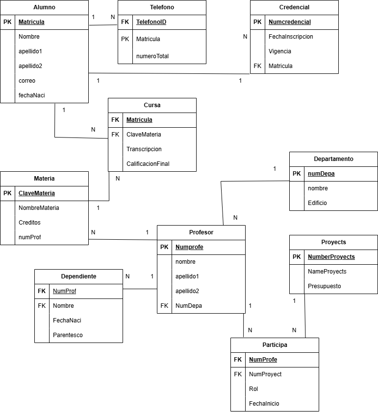
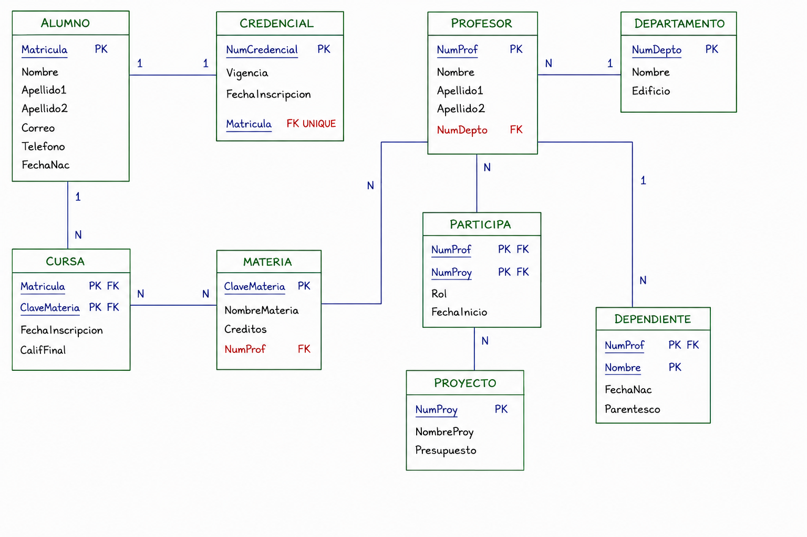

## EJERCICIO 1
## Modelo E-R
 

##  Modelo Relacional 

 

## EJERCICIO 2
## Modelo E-R
---
 

##  Modelo Relacional 

 .png)
---
 ## EJERCICIO 3
## Modelo E-R
---
 

##  Modelo Relacional

 
---
 ## EJERCICIO 4
## Modelo E-R
---
 

##  Modelo Relacional 

 
---
 ## EJERCICIO 5
## Modelo E-R
---
 

##  Modelo Relacional 

 
---
 ## EJERCICIO 6
## Modelo E-R
---
 

##  Modelo Relacional 

 
---

## EJERCICIO 7
##  Modelo E-R 

 
---

##  Modelo Relacional 

 
---